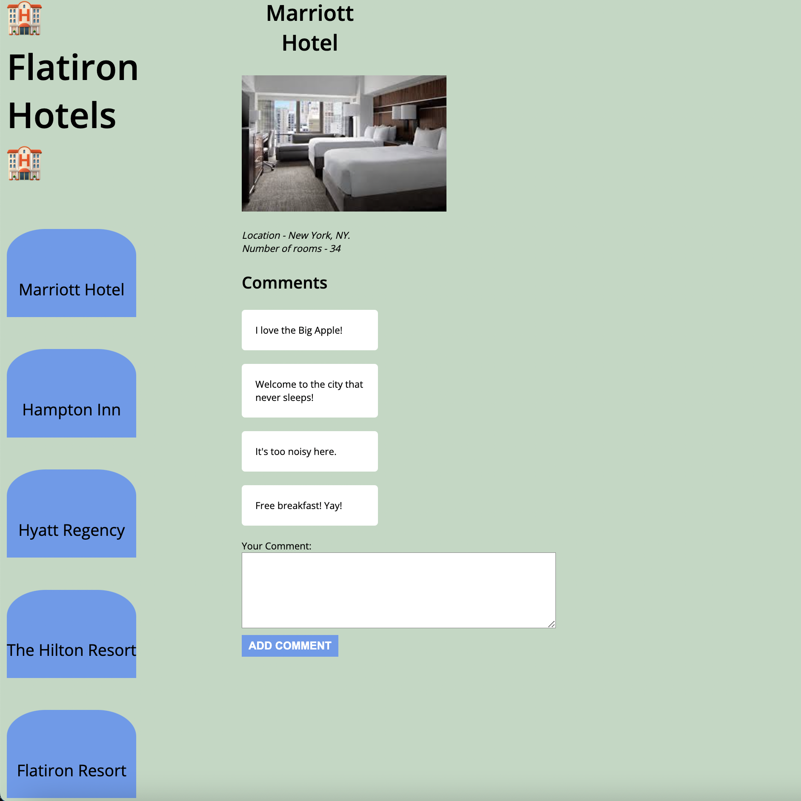

# Flatiron Hotels

Today you'll be using a local API to build out the frontend for a new
hotel website, _Flatiron Hotels_! Hotel companies submit photos of their hotels,
and viewers submit comments on the hotels.

## Demo

Use this image as an example of how the app should look once it is complete.



> To view in VSCode, right click on the README.md file and select "Open
> Preview".

## Setup

Run this command to get the backend started:

```console
$ json-server --watch db.json
```

Test your server by visiting this route in the browser:

[http://localhost:3000/hotels](http://localhost:3000/hotels)

Then, open the `index.html` file on your browser to run the application.

Write your code in the `src/index.js` file. The base URL for your API will be
[http://localhost:3000](http://localhost:3000).

## Deliverables

As a user, I can:

1. See the first hotel's details, including its **name, image, description, and
   comments**, when the page loads. You will need to make a GET request to the
   following endpoint to retrieve the hotel data, along with its associated
   comments:

   ```txt
   GET /hotels/1

   Example Response:
    {
      "id": 1,
      "name": "Marriott Hotel",
      "description": "Location - New York, NY. Number of rooms - 34",
      "image_url": "https://encrypted-tbn0.gstatic.com/images?q=tbn:ANd9GcQmfRm_2OCAxxj4V-_SwtYobcoGuleqbBUcig&usqp=CAU",
      "comments": [
        "I love the Big Apple!",
        "Welcome to the city that never sleeps!",
        "It's too noisy here.",
        "Free breakfast! Yay!"
      ]
    }
   ```

2. See a menu of all hotels in the `<nav>` element on the left side of the page
   when the page loads. You will need to make a GET request to the following
   endpoint to retrieve the hotel data:

   ```txt
   GET /hotels

   Example response:
   [
    {
      "id": 1,
      "name": "Marriott Hotel",
      "description": "Location - New York, NY. Number of rooms - 34",
      "image_url": "https://encrypted-tbn0.gstatic.com/images?q=tbn:ANd9GcQmfRm_2OCAxxj4V-_SwtYobcoGuleqbBUcig&usqp=CAU",
      "comments": [
        "I love the Big Apple!",
        "Welcome to the city that never sleeps!",
        "It's too noisy here.",
        "Free breakfast! Yay!"
      ]
    },
    {
      "id": 2,
      "name": "Hampton Inn",
      "description": "Location - Anaheim, California. Number of rooms - 23",
      "image_url": "https://encrypted-tbn0.gstatic.com/images?q=tbn:ANd9GcQLS-k_sNGRpMUXWfGk5d8Mc9WGrRWj9A_G9w&usqp=CAU",
      "comments": [
        "Best resort ever!!!",
        "Nice and relaxing vacation"
      ]
    }
   ]
   ```

3. Add a new comment to the page when the comment form is submitted. **No
   persistence is needed**.